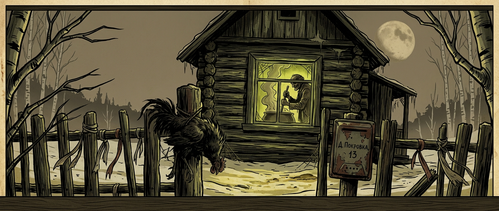

# 🩸 TALES FROM THE ДЕД 🩸
### *Сказки от Деда* — ежемесячный хоррор-комикс-антология

**EC Comics × Junji Ito × славянская деревенская безнадёга**

---

## ☦️ О проекте

Действие разворачивается в выдуманной деревне **Покровка**, застывшей между 1928 и 1991 годом. Правит ею **Дед** — старик, который варит «брагу особого назначения» и медленно укорачивает список живых в своём погребе. Ему помогают Мила и Витек — татуированная пара из Питера, подначивающая семьи к саморазрушению.

|   | Сезон 1 — «Хищники» | Сезон 2 — «Жертвы» |
|---|---|---|
| Кто? | Коля-Гиббон и Алёнка-Пропитуха | Куролес и Алла Михайловна |
| Чем опасны? | Грызут, манипулируют, доят | Пьют, рефлексируют, продают душу |
| Чем пахнут? | Сигареты, кислое вино, потные носки | Старые книги, духи и сивуха |

---

## 🎨 Визуальный стиль

- Палитра: оливково-зелёный, сепия, кровяной красный, желтушный, графитно-серый
- Контуры: 4–6 px чёрные заливки
- Состаренная жёлтая бумага + перекрёстная штриховка
- Стиль-гибрид: EC Comics × Junji Ito × русская гравюра XIX века
- Никакого аниме, чиби, кавай, диснеевщины

---

## 🗂️ Структура

tales357/ ├── index.html ├── README.md · LICENSE · SUPPORTING.md · CONTRIBUTING.md ├── PUSH.md · SECURITY.md · .gitignore · _config.yml ├── assets/{banner/banner.png} | {cover/cover.png} | {characters/*.png} └── brand-book/kolya/{index.html,reference-imgs/}

---

## 📅 Релизный план

| № | Название | Герои | Статус |
|---|---|---|---|
| 0 | «Пилот: Первый гость» | Дед + Мила + Витек | готовится |
| 1 | «Работник Нестор» | Дед + Куролес + Михайловна | следующий |
| 2 | «Любимчик Гриша» | Дед + Внук-любимчик + Бабка | Q1 |
| 3 | «Урожай» | Дед + семья Белловых | Q1 |
| 4 | «Страстотерпцы» | Мила + Витек + новые жертвы | Q2 |

---

## ⚖️ Лицензия

CC BY-NC-SA 4.0 — можно читать, копировать, переводить, делать ремиксы с указанием авторства, в некоммерческих целях, с сохранением той же лицензии. Полный текст в `LICENSE`.

---

*«Гостю дорогому — первый стакан. Хозяину терпеливому — последний.»*
— из погреба Деда

